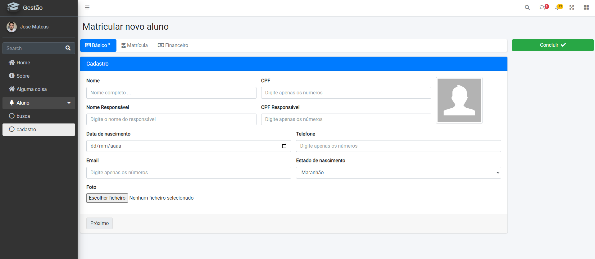
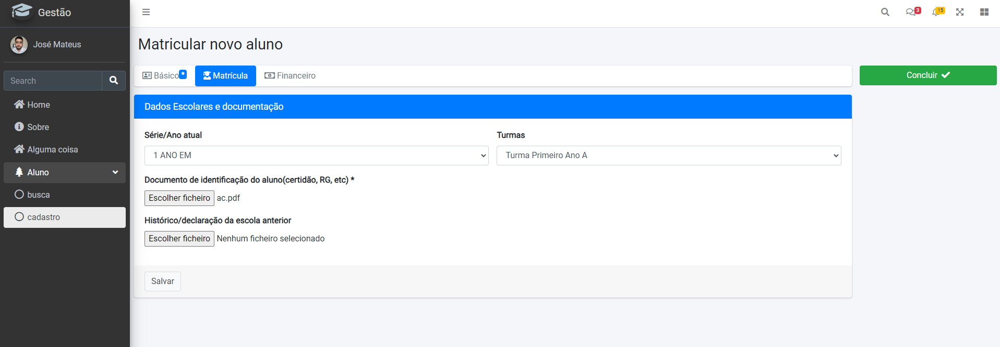
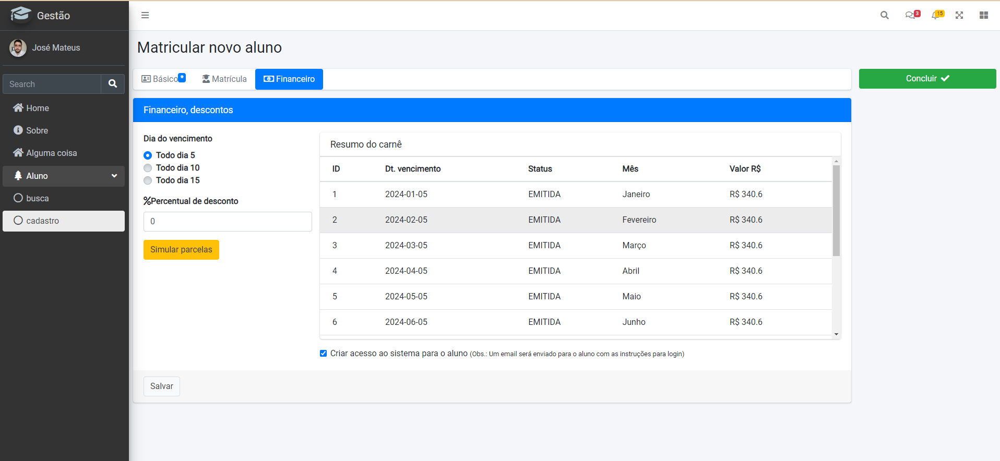
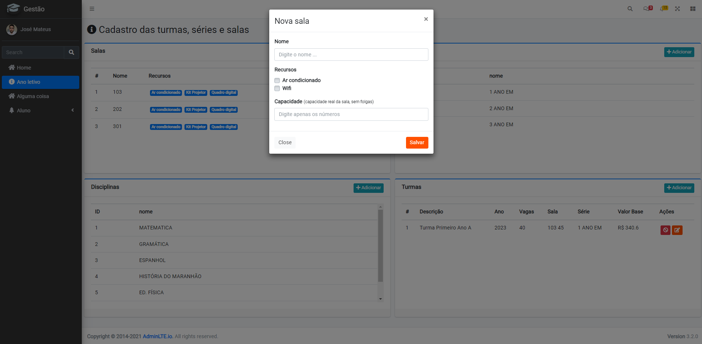
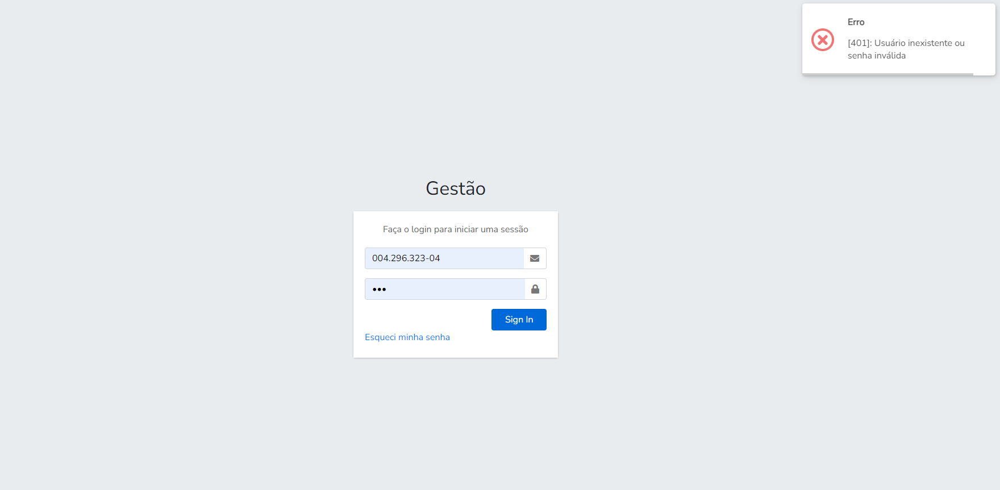
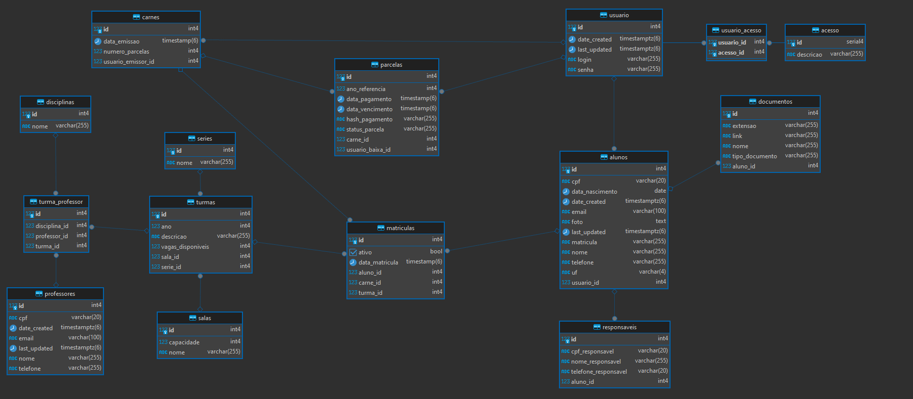

## Sistema de Gestão Escolar

### Telas de matrícula

### Tela de configuração do ano letivo

### Tela de login

### Banco (atualmente)

### Requisitos (atualmente)

- O sistema permite a criação de salas, series, disciplinas e turmas;
- Salas(nome), Series(nome), Disciplinas(nome), Turma(ano, descricao, vagas, sala, serie, valor base);
- O novo aluno tem as informações: data_nascimento, uf, usuario_id, date_created, last_updated, cpf, email, foto, matricula, nome, telefone
- O aluno precisa ter um responsável.
- O responsável tem as informações: cpf, telefone, nome
- O aluno possui anexos que serão informados na matrícula.
- Os anexos obrigatórios são: identificação do aluno, histórico da escola anterior, identificação do responsável
- No ato da matrícula, o usuário escolhe a série e sala para matricular o aluno caso haja vagas
- Para o caso de não existirem mais vagas para a série selecionada, o sistema deverá avisar ao usuário que não é possível incluir mais alunos (TODO: implementar vagas extras)
- Ao efeturar a matrícula, o sistema gera o carnê com as parcelas lançadas referentes ao ano corrente.

Tecnologias:

- Java 21 + Spring Boot 3.2
- Postgres
- VueJS 3
- Bootstrap

_Apenas para propósito de estudos._
