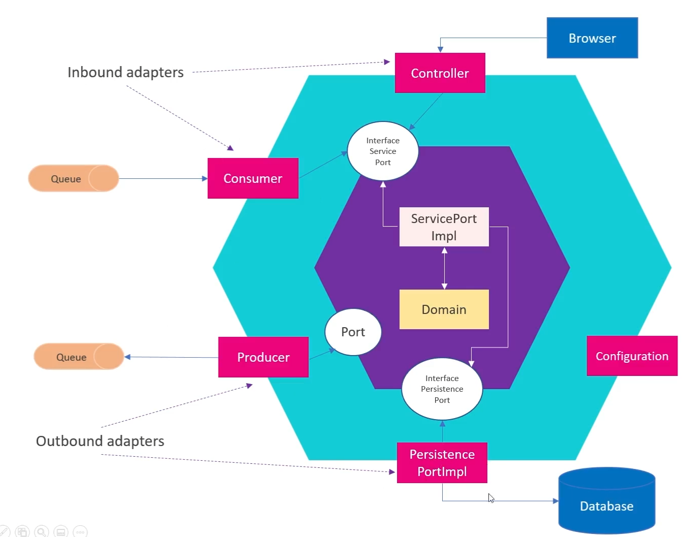

## Arquitetura Hexagonal

É um padrão de design de negócio onde focamos em camadas externas e internas. O objetivo é isolar as regras de negócio, o application core.
- Application Core: regras de negócio;
- Port: Interfaces de acesso ao mundo exterior (banco, terminal, brokers);
- Adapters: implementação das portas;
- Tipos de adapters: Inbound -> invocações externas (browsers via rest) OutBound -> invocações internas do application core;

Vantegens: testabilidade, manutenabilidade, organização da regra de negócio.
### Design:

